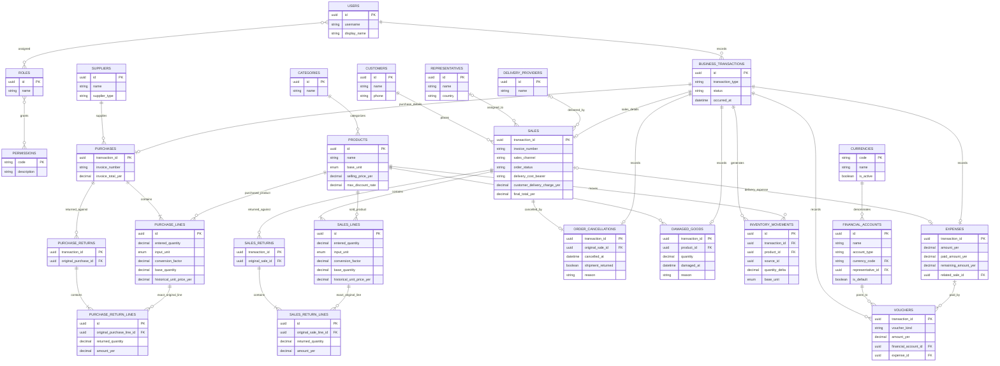

# Honey Shop core ERD

```mermaid
erDiagram
    USERS {
        uuid id PK
        string username
        string display_name
    }

    ROLES {
        uuid id PK
        string name
    }

    PERMISSIONS {
        string code PK
        string description
    }

    CATEGORIES {
        uuid id PK
        string name
    }

    PRODUCTS {
        uuid id PK
        string name
        enum base_unit
        decimal selling_price_yer
        decimal max_discount_rate
    }

    CURRENCIES {
        string code PK
        string name
        boolean is_active
    }

    SUPPLIERS {
        uuid id PK
        string name
        string supplier_type
    }

    CUSTOMERS {
        uuid id PK
        string name
        string phone
    }

    REPRESENTATIVES {
        uuid id PK
        string name
        string country
    }

    DELIVERY_PROVIDERS {
        uuid id PK
        string name
    }

    BUSINESS_TRANSACTIONS {
        uuid id PK
        string transaction_type
        string status
        datetime occurred_at
    }

    PURCHASES {
        uuid transaction_id PK
        string invoice_number
        decimal invoice_total_yer
    }

    PURCHASE_LINES {
        uuid id PK
        decimal entered_quantity
        enum input_unit
        decimal conversion_factor
        decimal base_quantity
        decimal historical_unit_price_yer
    }

    SALES {
        uuid transaction_id PK
        string invoice_number
        string sales_channel
        string order_status
        string delivery_cost_bearer
        decimal customer_delivery_charge_yer
        decimal final_total_yer
    }

    SALES_LINES {
        uuid id PK
        decimal entered_quantity
        enum input_unit
        decimal conversion_factor
        decimal base_quantity
        decimal historical_unit_price_yer
    }

    SALES_RETURNS {
        uuid transaction_id PK
        uuid original_sale_id FK
    }

    SALES_RETURN_LINES {
        uuid id PK
        uuid original_sale_line_id FK
        decimal returned_quantity
        decimal amount_yer
    }

    PURCHASE_RETURNS {
        uuid transaction_id PK
        uuid original_purchase_id FK
    }

    PURCHASE_RETURN_LINES {
        uuid id PK
        uuid original_purchase_line_id FK
        decimal returned_quantity
        decimal amount_yer
    }

    ORDER_CANCELLATIONS {
        uuid transaction_id PK
        uuid original_sale_id FK
        datetime cancelled_at
        boolean shipment_returned
        string reason
    }

    DAMAGED_GOODS {
        uuid transaction_id PK
        uuid product_id FK
        decimal quantity
        datetime damaged_at
        string reason
    }

    INVENTORY_MOVEMENTS {
        uuid id PK
        uuid transaction_id FK
        uuid product_id FK
        uuid source_id
        decimal quantity_delta
        enum base_unit
    }

    FINANCIAL_ACCOUNTS {
        uuid id PK
        string name
        string account_type
        string currency_code FK
        uuid representative_id FK
        boolean is_default
    }

    VOUCHERS {
        uuid transaction_id PK
        string voucher_kind
        decimal amount_yer
        uuid financial_account_id FK
        uuid expense_id FK
    }

    EXPENSES {
        uuid transaction_id PK
        decimal amount_yer
        decimal paid_amount_yer
        decimal remaining_amount_yer
        uuid related_sale_id FK
    }

    USERS }o--o{ ROLES : assigned
    ROLES }o--o{ PERMISSIONS : grants
    CATEGORIES ||--o{ PRODUCTS : categorizes
    CURRENCIES ||--o{ FINANCIAL_ACCOUNTS : denominates

    SUPPLIERS ||--o{ PURCHASES : supplies
    PURCHASES ||--|{ PURCHASE_LINES : contains
    PRODUCTS ||--o{ PURCHASE_LINES : purchased_product

    CUSTOMERS ||--o{ SALES : places
    SALES ||--|{ SALES_LINES : contains
    PRODUCTS ||--o{ SALES_LINES : sold_product
    REPRESENTATIVES o|--o{ SALES : assigned_to
    DELIVERY_PROVIDERS o|--o{ SALES : delivered_by

    SALES ||--o{ SALES_RETURNS : returned_against
    SALES_RETURNS ||--|{ SALES_RETURN_LINES : contains
    SALES_LINES ||--o{ SALES_RETURN_LINES : exact_original_line
    PURCHASES ||--o{ PURCHASE_RETURNS : returned_against
    PURCHASE_RETURNS ||--|{ PURCHASE_RETURN_LINES : contains
    PURCHASE_LINES ||--o{ PURCHASE_RETURN_LINES : exact_original_line
    SALES ||--o| ORDER_CANCELLATIONS : cancelled_by
    BUSINESS_TRANSACTIONS ||--o| ORDER_CANCELLATIONS : records

    PRODUCTS ||--o{ DAMAGED_GOODS : damaged_product
    BUSINESS_TRANSACTIONS ||--o| DAMAGED_GOODS : records
    BUSINESS_TRANSACTIONS ||--o{ INVENTORY_MOVEMENTS : generates
    PRODUCTS ||--o{ INVENTORY_MOVEMENTS : moves

    BUSINESS_TRANSACTIONS ||--o| PURCHASES : purchase_details
    BUSINESS_TRANSACTIONS ||--o| SALES : sales_details
    USERS ||--o{ BUSINESS_TRANSACTIONS : records

    BUSINESS_TRANSACTIONS ||--o{ VOUCHERS : records
    FINANCIAL_ACCOUNTS ||--o{ VOUCHERS : posts_to
    EXPENSES o|--o{ VOUCHERS : paid_by
    SALES o|--o| EXPENSES : delivery_expense
    BUSINESS_TRANSACTIONS ||--o| EXPENSES : records
```
